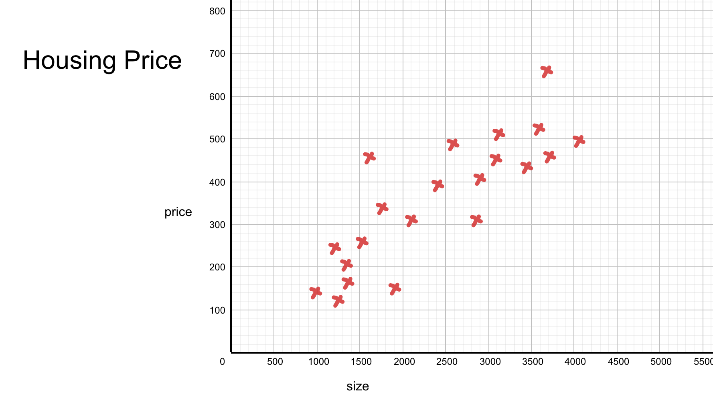
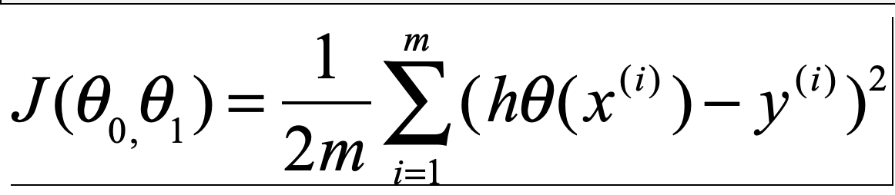
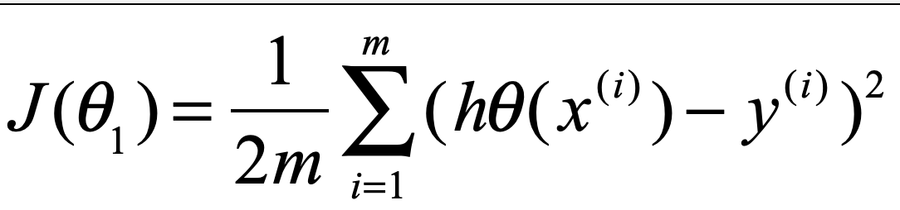
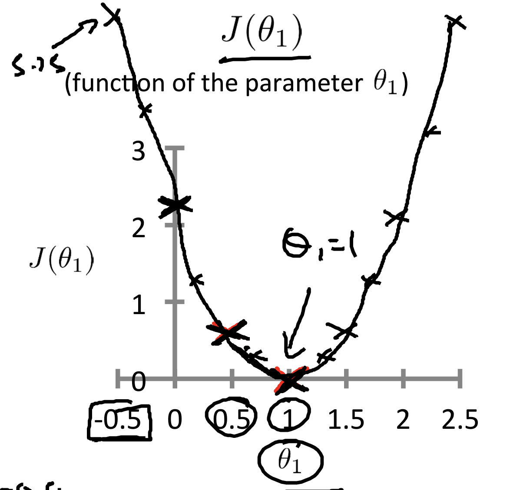
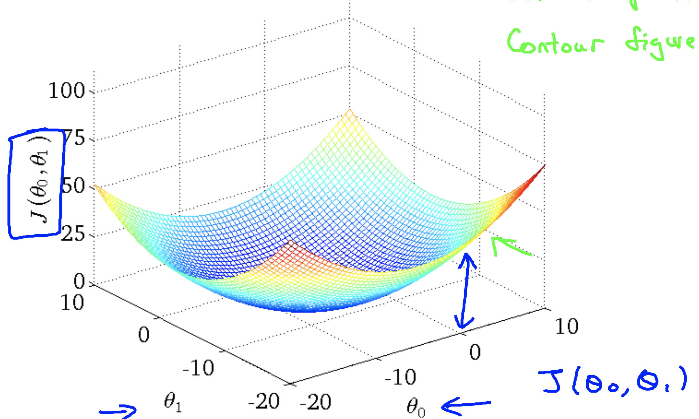

>这里有一个关于房子尺寸和价格的数据集:

|  |  |  |||||
| :-----| ----: | :----: | ----: | :----: |----: | :----: |
| x (size,平方) | 1000| 1100 |2000|2400|3000|...|
| y (price,万) | 130 | 125 |230|260|240|...|

具体数据分布如下图:

根据这些数据,我们可以找到一条曲线(二次方程)来表示**房子尺寸x和价格y**的关系:

`hθ(x) = θ_0 + θ_1 * x`

那么`hθ(x)`在什么时候最接近样本集呢 ？

>最接近的应该是对于每一个样本 `h(x_i)`近视相等于`y_i `, 那这时`θ_0、θ_1`等于多少呢？

即我们的目标:

**就是求`θ_0、θ_1`的最合理的值，来使任意样本(x_i, y_i)的`hθ(x_i) - y_i`近可能得相等)**

怎么求呢? 这里要引入代价函数的概念：

>简单的来说代价函数就是可以预测出`hθ(x_i)`与真实样本值`y_i`之间的差异的函数

这里`hθ(x) = θ_0 + θ_1 * x`的代价函数是:

>这里`m代表样本集的数量`, 那这个函数大体是个什么意思呢?

.....

这个函数其实是一个三维的函数，直接看可能不是很好理解。这里我们假设`θ_0 = 0, θ_1 = 1`,即变为:

取`m=3`,对上面这个函数求值，画出这个函数大约是下面这个样子:

通过上图可以看出在`θ_1=1`时`J(θ_1)`最小,此时对于每个样本`hθ(x_i)`与`y_i`的值最接近。如果只有`θ_1`这一个变量的话，其实此时`θ_1=1`就是最符合的取值，因为它可以使`hθ(x_i)`与`y_i`的值最接近。

那如果再加上一个`θ_0`呢？`J(θ_0,θ_1)`的数学曲线其实就变成了下面这个样子:

即类似于一个碗状的图形。参照上面的二维曲线，其实此时**使`hθ(x_i)`与`y_i`的值最接近**的`θ_0和θ_1`的取值应该是