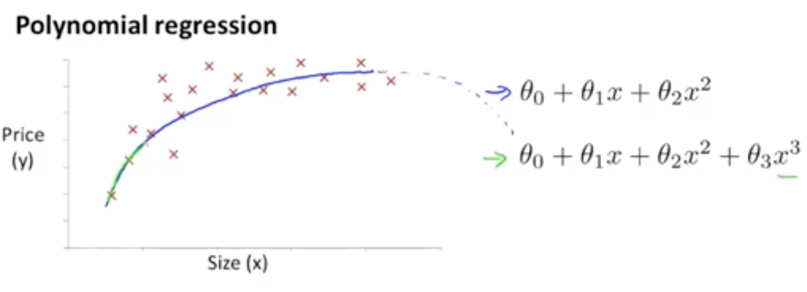
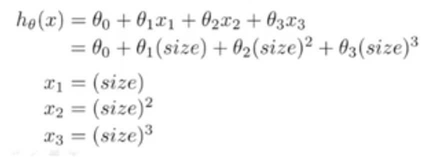
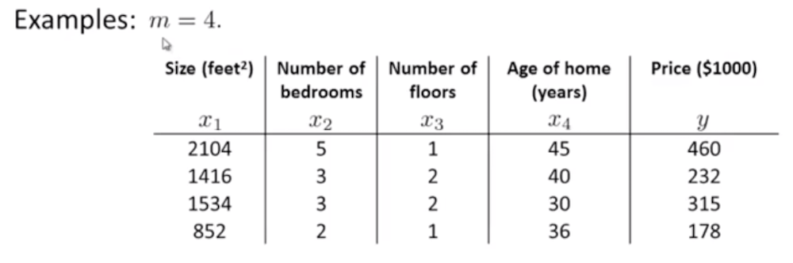
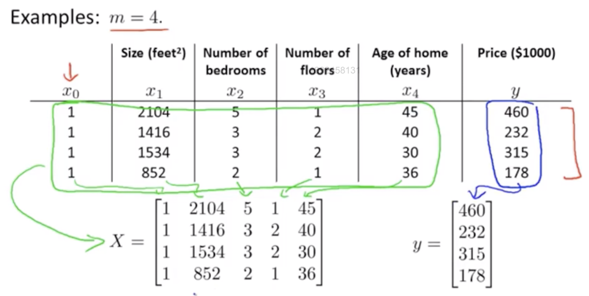
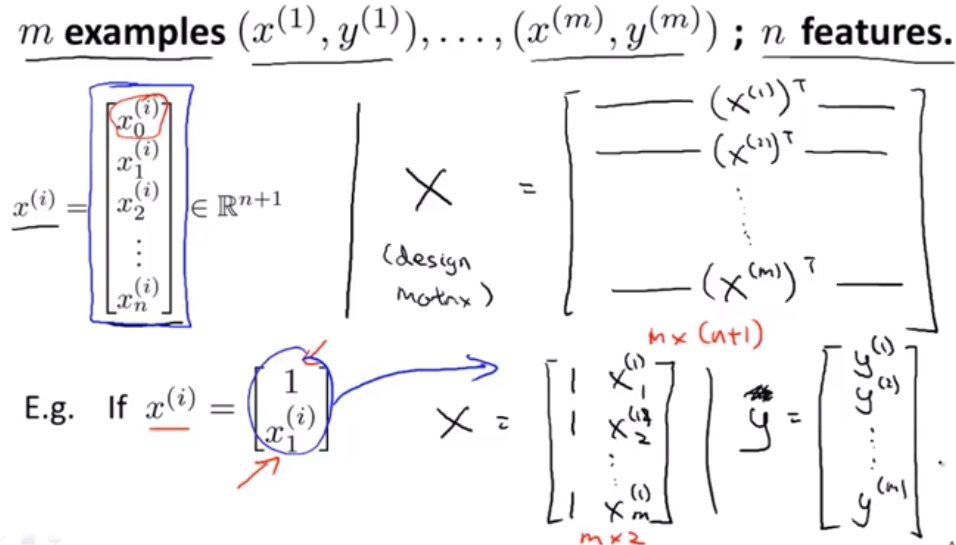
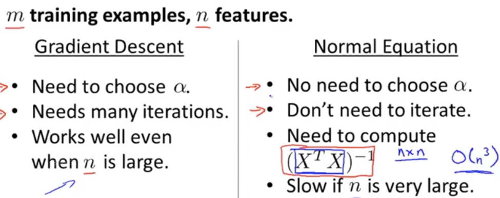

>本文是《吴恩达机器学习课程第五章》的简单笔记 

# 多变量线性回归

## 矩阵 (Matrix)

具体的概念这就细述了，可以参考一下这篇文章: https://juejin.im/post/5b1f28bee51d45069c2f0d8f#comment

这里简单的指出几个矩阵的关键特性:

>$(m \times n) \cdot (n \times o) = m \times o$

> 矩阵运算不服从交换律, 即 $A \times B \ne B \times A$

>矩阵运算服从结合律, 即 $A \times B \times C = (A \times B ) \times C = A \times (B \times C)$

- 单位矩阵具有下面特性

> $I \times A = A \times I = A$, 即一个矩阵乘以单位矩阵等于它自己

> $A \times A^{-1} = A^{-1} \times A = I$, 即一个矩阵乘以它的逆矩阵就等于单位矩阵

- 假设A的转置矩阵为B,则 $B_{ij} = A_{ji}$

### 如何计算逆矩阵

>先回顾一下矩阵的行列式

矩阵A的行列式，|A| 为 : 

$$
A = 
\begin{matrix}
        a&b\\
        c&d
 \end{matrix}
$$

$A$的行列式$|A|$为$|A| = ad-bc$

>A的逆矩阵$A^{-1}$为:

$$
A^{-1} = \frac{1}{|A|} \cdot
\begin{matrix}
d & -b\\
-c & a
\end{matrix}
$$

## 特征缩放 (Feature Scaling)（归一化）

>特征缩放简单来说是用来标准化数据特征的范围。比如在梯度下降算法中，特征缩放可以提高算法的收敛速度。

### 特征缩放的方法

1. 调解比例

这种方法是将数据的特征缩放到[0,1]或[-1,1]之间。缩放到什么范围取决于数据的性质。对于这种方法的公式如下:

$
x^{'}=\frac{x-min(x)}{max(x) - min(x)}
$

>$x$是最初的特征值, $x^{'}$是缩放后的值。

2. 标准化

特征标准化使每个特征的值有零均值(zero-mean)和单位方差(unit-variance)。这个方法在机器学习地算法中被广泛地使用。例如：SVM，逻辑回归和神经网络。这个方法的公式如下：

$
x^{'} = \frac{x - \overline{x} }{\sigma}
$

${\sigma}$ 是特征值$x$的取值范围

## 多项式回归

>先回顾一下**线性回归和多项式**的概念

- 多项式

多项式（Polynomial）是代数中的基础概念，是由称为未知数的变量和称为系数的常数通过有限次加减法、乘法以及自然数幂次的乘方运算得到的代数表达式。多项式是整式的一种。未知数只有一个的多项式称为一元多项式；例如 ${\displaystyle x^{2}-3x+4} {\displaystyle x^{2}-3x+4}$就是一个三项一元二次多项式。未知数不止一个的多项式称为多元多项式，例如 ${\displaystyle x^{3}+2y-3z} {\displaystyle x^{3}+2y-3z}$就是一个三项三元三次多项式，一个多项式就几次取决于最高的那个项的次数

- 回归

可以参见百度百科**线性回归 : https://baike.baidu.com/item/%E7%BA%BF%E6%80%A7%E5%9B%9E%E5%BD%92**

个人理解是，比如我们有一组房屋大小$x$与房间$y$的数据集，我们假设$y$与$x$的关系为$y=\theta_{0}+\theta_{1}x$ 。那么确定$\theta_{0}$和$\theta_{1}$就是对$y=\theta_{0}+\theta_{1}x$的回归。

### 简化特征

比如我们有一组关于房子价格的数据集，这个数据集包括房子价格$y$、房子长度$m$和房子宽度$n$, 假设他们之间的关系是$y=\theta_{0}+\theta_{1}n+\theta_{2}m$。这个是一个二元多项式，我们其实可以创造另一个特征$x$，它代表房子的大小(即$size$),它与$m$和$n$的关系为: $x=m \times n$。所以可以这样预测$y$的值 :$y=\theta_{0}+\theta_{1}x$, 这样我们就将特征方程由二元变为了一元，可以更方便的去拟合曲线。

## 选择更符合的数据集的曲线

比如我们有下面这种$y$与$x$的数据集:

相较于$\theta_{0}+\theta_{1}x+\theta_{2}x^{2}$。 $\theta_{0}+\theta_{1}x+\theta_{2}x^{2}+\theta_{3}x^{3}$可以更好的拟合目标数据集曲线。

为了更方便的回归，我们可以这样优化这个方程:

但这时候$x_{1}$的取值范围可能是:1~1000, $x_{2}$的取值范围可能是:1~1000000, $x_{3}$的取值范围可能是:1~$10^{12}$。如果我们直接对这个多项式进行梯度下降的话，那么梯度下降收敛的可能会非常的快，因此这时候，我们需要对$x_{1},x_{2}, x_{3}$做特征缩放来使梯度下降更有效率。

其实这里也可以使用平方根函数来拟合这条曲线:

$$ h_{\theta}(x) = \theta_{0} + \theta_{1}(size)+\theta_2\sqrt{size} $$

## 正规方程

比如我们有以下数据集:

我么可以用下面这个多项式来拟合它:

$$y = \theta_{0}+\theta_{1}x_{1}+\theta_{2}x_{2}+\theta_{3}x_{3}+\theta_{4}x_{4}$$

那么如何求出它的代价函数$J_({\theta_{0}, \theta_{1},\theta_{2},\theta_{3},\theta_{4}})$的最小值呢？

我们可以使用梯度下降，不过**正规方程**的方法可以更快的求出$\theta_{0}$等的值。

首先我们可以把上面数据抽象为下面这种矩阵:

那么 : 

$\theta = (X^{T}X)^{-1}X^{T}y$

上面这个公式是怎么推导来的呢？ 可以参考这篇文章的推导过程 : https://www.jianshu.com/p/ae9c611fb1ca

### 解析 $\theta = (X^{T}X)^{-1}X^{T}y$

$X$是什么呢？

以上图的数据为例:

$$
X = 
\begin{matrix}

1 &2014&5&1&45 \\
1&1416&3&2&40 \\
1&1534&3&2&30 \\
1&852&2&1&36

\end{matrix}
$$

$X$的生成过程如下图:

$(X^{T}X)^{-1}$ 是 $X^{T}X$的逆矩阵。在 `Ocatave`中，计算上面$\theta$只需要一个公式:

Octave: pinv $(X^{'} \ast X) \ast X^{'} \ast y$， 这个命令会给出最优的$\theta$

>$pinv $(X^{'} \ast X)$ 就代表$(X^{T}X)^{-1}$的逆矩阵。

正规方程求解最优$\theta$是不需要进行特征缩放的。

## 正规方程与梯度下降

它们之间的优缺点如下图:

一个比较简单的选择方式是，如果n小于10000那么可以使用正规方程来求解$\theta$(现在计算机都可以搞定),否则可以使用梯度下降。

对于线性回归来说，正规方程法在大部分情况下要优于梯度下降。

### 正规方程中的不可逆

如果$X^{T}X$是不可逆的话（其实这种情况很少），在ocatave中,使用$pinv$一定可以计算出一个矩阵的逆矩阵。

通常不可逆是由下面原因导致的:

1. 包含了多余的学习特征 (指有两个含义差不多的特征)
2. 有太多的学习特征 (m < n), 在这种情况下可以删除一些特征。

>参考文章

为什么要对特征进行缩放(归一化) : https://zhuanlan.zhihu.com/p/25234554