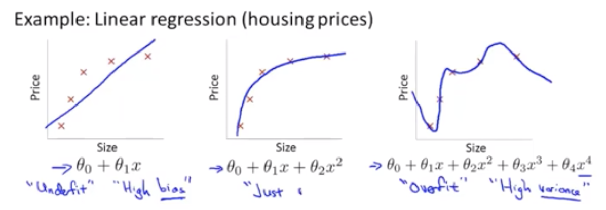
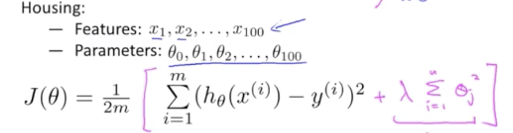

## 欠拟合与过拟合问题

比如我们在拟合一个房价与房屋面积的曲线时,我们可以选择下面3个曲线中的一个:

从上图可以看出$\theta_{0}+\theta_{1}x+\theta_{2}x^{2}+\theta_{3}x^{3}+\theta_{4}x^{4}$对数据拟合的最为准确。但是它存在一个问题，就是无法泛华的新增的样本中,这种拟合就是过拟合。

- 欠拟合（underfitting）
  
拟合程度不高，数据距离拟合曲线较远，如下左图所示。

- 过拟合（overfitting）

过度拟合，貌似拟合几乎每一个数据，但是丢失了信息规律，不能恰当拟合新增数据样本。

那么如何解决**过拟合**问题呢？

- 减少feature数量
    - 人为判断减少
    - model selection algorithm
- 正则化 : 保留所有的feature，减少$\theta_{j}$的大小
  
## 正则化

可以这样理解正则化:

>它不放弃特征，而是拉伸曲线使之更加平滑以解决过拟合问题，为了拉伸曲线，也就要弱化一些高阶项（曲线曲折的罪魁祸首）。由于高阶项中的特征  x  无法更改，因此特征是无法弱化的，我们能弱化的只有高阶项中的系数  θi 。我们把这种弱化称之为是对参数  θ  的惩罚（penalize）。Regularization（正规化）正是完成这样一种惩罚的“侩子手”

比如文章一开始的:$\theta_{0}+\theta_{1}x+\theta_{2}x^{2}+\theta_{3}x^{3}+\theta_{4}x^{4}$,我们可以通过减小$\theta_{3},\theta_{4}$的值来使这个拟合曲线更加平滑。

但是当我们面对一个问题时，我们是不知道惩罚(penalize)哪一个$\theta_{j}$的，比如我们又这样一个待拟合的数据集(线性回归):

既然我们不知道惩罚(penalize)哪一个$\theta_{j}$，那么我们可以惩罚所有的$\theta_{j}$,即在代价函数中引入$\lambda\sum_{i=1}^{m}\theta_{j}^{2}$

$$
J_{\theta} = \frac{1}{2m}[\sum_{i=1}^{m}(h_{\theta}(x^{i}) - y^{i})^{2} + \lambda\sum_{i=1}^{m}\theta_{j}^{2}]
$$

>我们一般是不会penalize $\theta_{0}$的

上面$\lambda\sum_{i=1}^{m}\theta_{j}^{2}$称为正则化项1(regularization term)，$\lambda$称为正则化参数,它主要有两个任务:

1. 保证对数据的拟合良好
2. 保证$\theta$足够小，避免过拟合问题。

>那么如何选择合适的$\lambda$呢？ 这个后面会讲到

### 正则化后的梯度下降

我们对正则化后的$J_{\theta}$进行梯度下降会发现:

$$
 \theta_{j} := \theta_{j} - \alpha[\sum_{i=1}^{m}(h_{\theta}(x^{(i)} - y^{(i)})x_{j}^{(i)} + \frac{\lambda}{m}\theta_{j}]

\\

  \theta_{j} := \theta_{j}(1-\alpha\frac{\lambda}{m}) - \alpha\sum_{i=1}^{m}(h_{\theta}(x^{(i)} - y^{(i)})x_{j}^{(i)}
$$

$1-\alpha\frac{\lambda}{m} < 1$, 所以在每次梯度下降的过程中, $\theta_{j}$都会减小(比没正则化前减的更快)。

### 正则化后的正规方程

参考文章

>https://yoyoyohamapi.gitbooks.io/mit-ml/content/%E7%BA%BF%E6%80%A7%E5%9B%9E%E5%BD%92/articles/%E6%AC%A0%E6%8B%9F%E5%90%88%E4%B8%8E%E8%BF%87%E6%8B%9F%E5%90%88.html