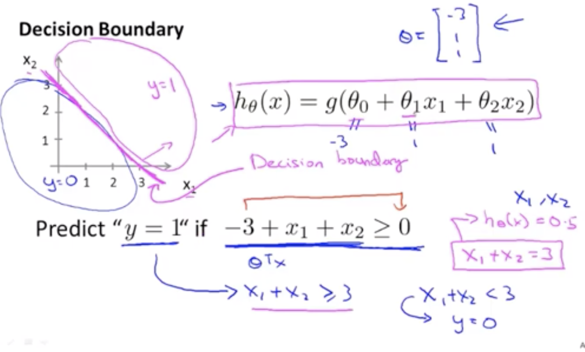

### 什么是逻辑回归？ 它与线性回归有什么关系呢？

简单来说， 逻辑回归（Logistic Regression）是一种用于解决二分类（0 or 1）问题的机器学习方法，用于估计某种事物的可能性。比如某用户购买某商品的可能性，某病人患有某种疾病的可能性，以及某广告被用户点击的可能性等。(注意，这里用的是“可能性”，而非数学上的“概率”，logisitc回归的结果并非数学定义中的概率值，不可以直接当做概率值来用。该结果往往用于和其他特征值加权求和，而非直接相乘)

逻辑回归（Logistic Regression）与线性回归（Linear Regression）都是一种广义线性模型（generalized linear model）。逻辑回归假设因变量 y 服从伯努利分布，而线性回归假设因变量 y 服从高斯分布。 因此与线性回归有很多相同之处，去除Sigmoid映射函数的话，逻辑回归算法就是一个线性回归。可以说，逻辑回归是以线性回归为理论支持的，但是逻辑回归通过Sigmoid函数引入了非线性因素，因此可以轻松处理0/1分类问题。

> 伯努利分布 : https://zh.wikipedia.org/wiki/%E4%BC%AF%E5%8A%AA%E5%88%A9%E5%88%86%E5%B8%83

> 高斯分布 : https://zh.wikipedia.org/wiki/%E6%AD%A3%E6%80%81%E5%88%86%E5%B8%83

## 逻辑回归

假设有下面数据集合,它表示对于不同的肿瘤大小(tumor size),病人患癌症的概率$y$:

假设$h_{\theta}(x) = y$, 从上图我们大致可以预测:

$$
if \ h_{\theta}(x) > 0.5  y = 1 \\
if \ h_{\theta}(x) < 0.5  y = 0
$$

上面这个数据看上去是可以使用线性方程来拟合，但是，如果一个 `y = 1`的数据样本出现在了一个不稳定的位置，那么就可能导致整个线性回归失败:

对于这种问题，我们希望我们的回归方程:

$$ 0 <= h_{\theta}(x) <= 1 $$

并且:

$$ P(y=0 | x, \theta) + P(y=1 | x, \theta)  = 1$$

`Sigmoid Fuction (Logisitic Function)`就可以很好的满足上面的要求,它的函数表达式是:

$$ g(z) = \frac{1}{1 + e^{-z}}$$

它的函数图像是:

所以对于上面的肿瘤问题，可以假设:

$$
h_{\theta}(x) = g(\theta^{T}x)
$$

$$
z = \theta^{T}x
$$

$$
g(z) =  \frac{1}{1 + e^{-z}}
$$

即:

$$
h_{\theta}(x) =  \frac{1}{1 + e^{-\theta^{T}x}}
$$

所以$\theta^{T}x$取什么值可以正确的回归上面的`肿瘤大小与患癌症概率`的数据集呢？

### 决策边界

在具体求$\theta^{T}$之前，我们先来了解一下**决策边界**的概念,以下面数据为例:

假设$\theta_{0} = -3,\theta_{1} = 1,\theta_{2} = 1$，可以正确的回归左面的数据模型, 则:

如果
$$
 -3 + x_{1} + x_{2} >= 0
$$

那么$g(z) =  \frac{1}{1 + e^{-z}} > 0.5$, 那么此时 $y = 1$

$-3 + x_{1} + x_{2} >= 0$ 就是决策边界,即以它为边界，我们可以知道在$\theta^{T}$确定了的情况下, 数据集在什么时候 $h_{\theta}(x) = 1$,什么时候$h_{\theta}(x) = 0$

>决策边界就是用来划清界限的边界，边界的形态可以不定，可以是点，可以是线，也可以是平面。决策边界是预测函数 $h_{\theta}(x)$的属性，而不是训练集属性。

### 求解逻辑回归问题的 $\theta^{T}$

逻辑回归方程我们已经找到了:

$$
h_{\theta}(x) =  \frac{1}{1 + e^{-\theta^{T}x}}
$$

那如何求解$\theta^{T}$呢？回顾一下线性回归的代价函数$J_{\theta}$:

$$
J_{\theta} = \frac{1}{m}\sum_{i=1}^{m}(h_{\theta}(x^{i}) - y^{i})^{2}
$$

它也可以表述成下面这种形式, 不过对于逻辑回归来说 $
h_{\theta}(x) =  \frac{1}{1 + e^{-\theta^{T}x}}
$

$$
Cost(h_{\theta}(x), y) = \frac{1}{2}(h_{\theta}(x) - y)^{2}
$$

但是它的上面这种代价函数的图形为下凹的波浪状,这样波浪状的代价曲线会使我们在做梯度下降的时候陷入迷茫，任何一个极小值都有可能被错认为最小值，但无法获得最优预测精度。但在右图的代价曲线中，就像滑梯一样，我们就很容易达到最小值:

所以逻辑回归的代价函数不能简单的套用线性回归的模型，对于逻辑回归来说，它的代价函数是:

$$

Cost(h_{\theta}(x), y) =  
\begin{cases}
- \log(h_{\theta}(x))& if & y = 1\\
- \log(1 - h_{\theta}(x))& if& y = 0
\end{cases}

$$

如果 y = 1 , $Cost(h_{\theta}(x), y)$的 像如下:

上图$h_{\theta}(x) = 1$时， Cost = 0, 这时可以得到最佳的$\theta^{T}$, 但是当$h_{\theta}(x)$趋近于0时，Cost趋向于无穷。即此时的预测是是十分不合理的,在这种情况下: 

$$P(y=1 | x, \theta)  = 0$$

如果 y = 0, 代价函数图像如下:

其实上面$Cost(h_{\theta}(x), y)$可以化简为下面这种形式:

$$
Cost(h_{\theta}(x), y) = -y\log(h_{\theta}(x)) - (1-y)\log(1 - h_{\theta}(x))
$$

>这种写法是通过统计学中的**极大似然法**得来的 : https://zhuanlan.zhihu.com/p/26614750

所以逻辑回归的代价函数为:

$$
J(\theta) = -\frac{1}{m}\sum_{i=1}^{m}[ y\log(h_{\theta}(x)) +(1-y)\log(1 - h_{\theta}(x))]
$$

可以利用梯度下降算法来求解$minJ(\theta)$:

$$
 \theta_{j} := \theta_{j} - \alpha\sum_{i=1}^{m}(h_{\theta}(x^{(i)} - y^{(i)})x_{j}^{(i)}
$$

上面梯度下降的公式其实和线性回归相似，但是不同的是: 

$$
h_{\theta}(x) =  \frac{1}{1 + e^{-\theta^{T}x}}
$$

我们可以编写代码通过梯度下降来求$minJ(\theta)$,不过除了梯度下降以外，还有一些更高级的算法可以求解$minJ(\theta)$:

上面这些算法我们并不需要自己去实现，我们可以调用一些现有的库:

>https://zhuanlan.zhihu.com/p/28408516