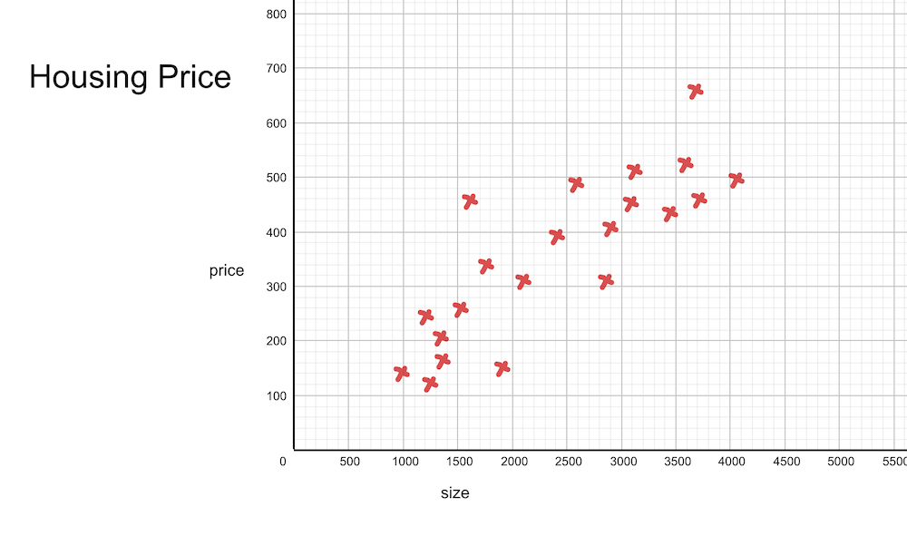
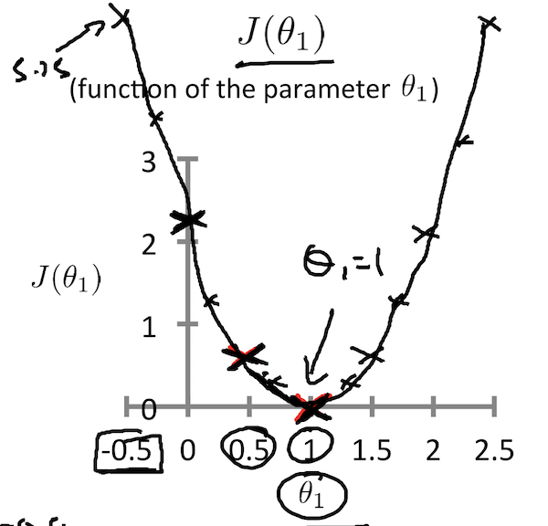
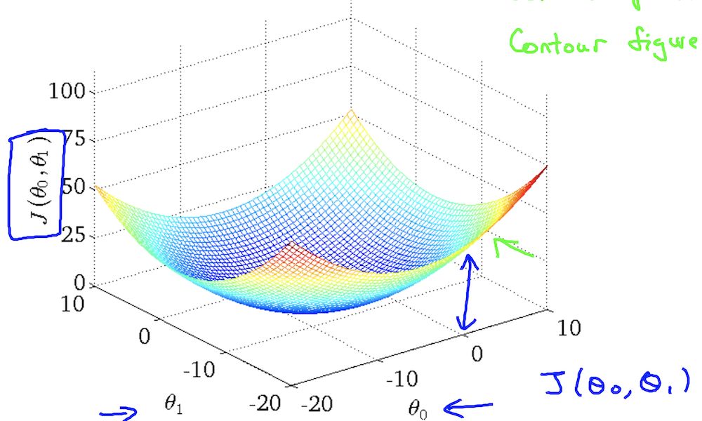
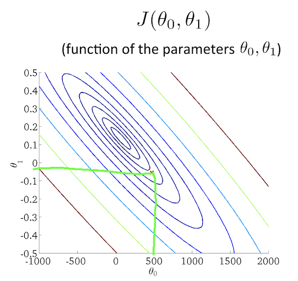
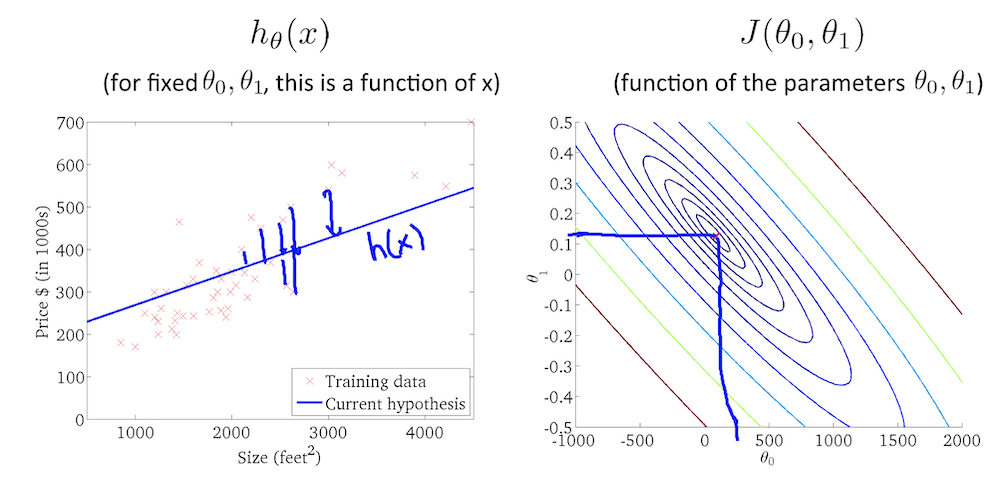
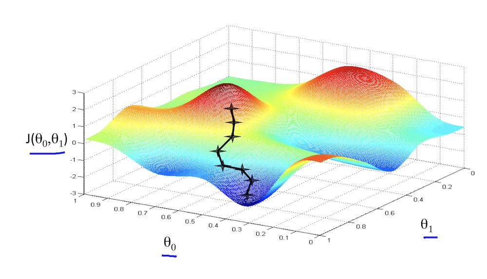
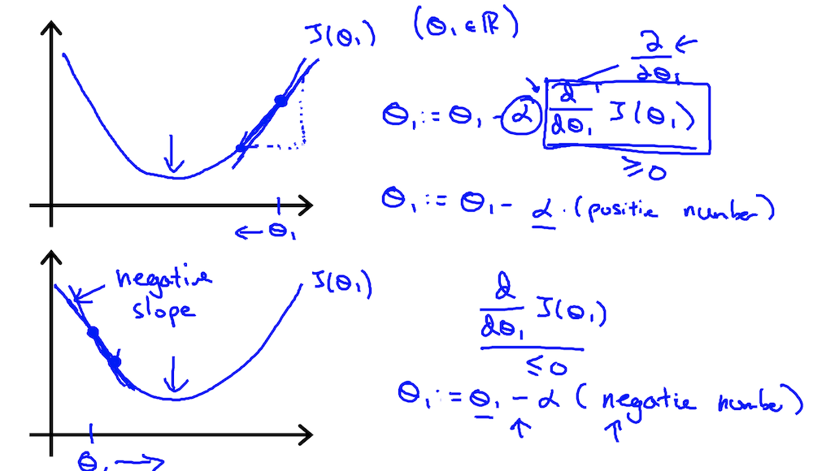
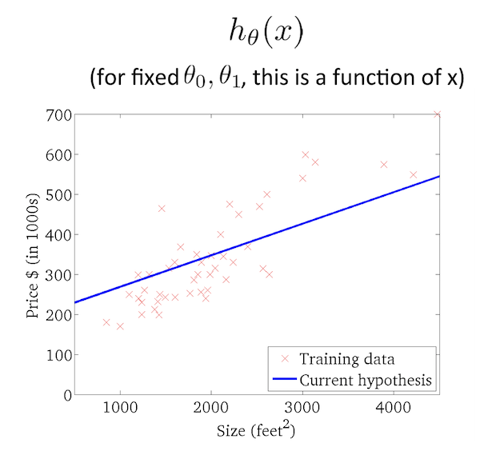

>本文是《吴恩达机器学习课程第二章》的简单笔记 

# 引入问题

>这里有一个关于房子尺寸和价格的数据集:

|  |  |  |||||
| :-----| ----: | :----: | ----: | :----: |----: | :----: |
| x (size,平方) | 1000| 1100 |2000|2400|3000|...|
| y (price,万) | 130 | 125 |230|260|240|...|

具体数据分布如下图:

根据这些数据, 猜想们可以找到一条曲线(二次方程)来表示**房子尺寸x和价格y**的关系:

$h_{\theta}(x) = \theta_{0} + \theta_{1}x$

那么$h_{\theta}(x)$在什么时候最接近样本集呢 ？

>最接近的应该是对于每一个样本$h(x^{i})$近视相等于$y^{i}$, 那这时$\theta_{0},\theta_{1}$等于多少呢？

即我们的目标:

**就是求$\theta_{0},\theta_{1}$的最合理的值，来使任意样本$x^{i}, y^{i}$的`$h_{\theta}x^{(i)}与y^{i}$近可能得相等)**

# 代价函数

怎么求呢? 这里要引入代价函数的概念：

>简单的来说代价函数就是可以预测出$h_{\theta}x^{(i)}$与真实样本值$y^{i}$之间的差异的函数

这里$h_{\theta}(x) = \theta_{0} + \theta_{1}x$的代价函数是:

$$
J_{(\theta_{0}, \theta_{1})} = \frac{1}{2m}\sum_{i=1}^{m}(h_{\theta}x^{(i)} - y^{(i)})^{2} 
$$

>这里`m代表样本集的数量`。$J_{(\theta_{0}, \theta_{1})}$的大致含义就是取不同$\theta_{0}, \theta_{1}$ 时 $h_{\theta}x^{(i)}与y^{i}$的差值。

那这个函数是怎么推导出来的呢？ 

>这里我还没推导过。不过这里可以回顾一下我们`平均值(Mean)、方差(Variance)、标准差(Standard Deviation)`这个公式和方差的公式比较像。具体可以参考这篇文章: http://blog.shaochuancs.com/mean-variance-sd/

我们可以取$m=3$，然后取不同的$\theta_{0}和\theta_{1}$作图，这个函数其实是一个三维的函数,直接看可能不是很好理解。这里我们先假设$\theta_{0}$,即变为:

$$
J_{(\theta_{1})} = \frac{1}{2m}\sum_{i=1}^{m}(h_{\theta}x^{(i)} - y^{(i)})^{2} 
$$

取$m=3$,对上面这个函数作图:

通过上图可以看出在$\theta = 1$时,$J_{(\theta_{1})}$最小,此时对于每个样本$h_{\theta}x^{(i)}$与$y_{i}$的值最接近。如果只有$\theta_{1}$这一个变量的话，其实此时$\theta = 1$就是最符合的取值，因为它可以使$h_{\theta}x^{(i)}$与$y_{i}$的值最接近。

那如果再加上一个$\theta_{0}$呢？$J_{(\theta_{0}, \theta_{1})}$的数学曲线其实就变成了下面这个样子:

即类似于一个碗状的图形。参照上面的二维曲线，其实此时**使$h_{\theta}x^{(i)}$与$y_{i}$的值最接近**的$\theta_{0}和\theta_{1}$的取值应该是这个碗状图最凹的地方。

对于这个`碗状图`,我们可以使用`等高线`图来理解，它的等高线图如下图所示:

>`等高线`图的大概意思就是分别取不同的$\theta_{0}和\theta_{1}$,把所有相等的$J_{(\theta_{0}, \theta_{1})}$点连接起来。

$J_{(\theta_{0}, \theta_{1})}$的`等高线`图类似于一个逐渐收敛的圆环，取不同的$\theta_{0}和\theta_{1}$它所对应的$h_{\theta}(x)$是不同的，结合上面的`3D碗状图形`，其实使$h_{\theta}(x)$与$y_{i}$最接近的点就是`3D碗状图的最低点`和`等高线图的最收敛处`,其实就是下面这个点，取这个点的$\theta_{0}和\theta_{1}$时，它对应的$h_{\theta}(x)$的曲线是这样的:

OK，到目前为止我们已经在图形上找到了目标的$\theta_{0}和\theta_{1}$,那么我们如何具体求出它们的值呢？？？

# 梯度下降

这里我们要引入**梯度下降**的概念。梯度下降的算法大概可以这样理解:

>梯度下降法的基本思想可以类比为一个下山的过程。假设这样一个场景：一个人被困在山上，需要从山上下来(i.e. 找到山的最低点，也就是山谷)。但此时山上的浓雾很大，导致可视度很低。因此，下山的路径就无法确定，他必须利用自己周围的信息去找到下山的路径。这个时候，他就可以利用梯度下降算法来帮助自己下山。具体来说就是，以他当前的所处的位置为基准，寻找这个位置最陡峭的地方，然后朝着山的高度下降的地方走，同理，如果我们的目标是上山，也就是爬到山顶，那么此时应该是朝着最陡峭的方向往上走。然后每走一段距离，都反复采用同一个方法，最后就能成功的抵达山谷。

具体解释可以参考这篇博客: https://www.jianshu.com/p/c7e642877b0e  

具体的下山过程如下图所示:

>那么如何在每次下降时确定往哪里走呢？即最陡峭的地方怎么算呢？

我们可以使用**梯度下降**算法，这里直接给出$J_{(\theta_{0}, \theta_{1})}$的梯度下降函数:

$$
repeat \quad \{ \\

\quad \quad  \quad \quad  \theta_{j} :=   \theta_{j}  - \alpha\frac{\partial}{\partial\theta_{j}}J_{(\theta_{0}, \theta_{1})}
\\
\quad \quad  \quad \quad  for \quad j = 1 \quad and \quad j = 0
\\
 \}
$$

这个公式的大体含义是:

**我们通过这个`梯度下降函数`不断更新$\theta_{0}和\theta_{1}$的值，直到他们不能再更新为止, 那么此时的$\theta_{0}和\theta_{1}$的取值就是我们要找的目标值**

>- $:=$可以简单的理解我我们编程中的赋值符号
>- $\alpha$叫做学习速率，它越大，梯度下降的速率就越快 

为了理解$J_{(\theta_{0}, \theta_{1})}$的梯度下降，我们这里先假设$\theta_{0} = 0$,那么`梯度下降`函数就变为:

$$
\quad \quad  \quad \quad  \theta_{j} :=   \theta_{j}  - \alpha\frac{\partial}{\partial\theta_{j}}J_{(\theta_{1})}
$$

$$
\theta_{j} := \theta_{j} - \alpha \sum_{i=1}^{m}(h_{\theta}(x^{i} - y^{(i)})x_{j}^{(i)}
$$

上面这个函数的$\frac{\partial}{\partial\theta_{j}}J_{(\theta_{1})}$部分,可以理解为$J_{(\theta_{1})}$的导数，导数其实可以理解为某点直线的**斜率**

>对于导数的理解可以参考这个知乎的回答: https://www.zhihu.com/question/28684811

我们对$J_{(\theta_{1})}$做图，然后取两个不同的$\theta_{1}$点，再套用梯度下降的公式来更新$\theta_{1}$的值发现，新的$\theta_{1}$的值是不断在靠近$J_{(\theta_{1})}$的最低点的，即使用**梯度下降算法来下山是正确的！！**

上图在什么时候$\theta_{1}$不能继续被更新呢？ 其实就是在最低点，此时:

$$
\theta_{j} = \theta_{j} - 0
$$

0就是$J_{(\theta_{1})}$在最低点时的导数，即斜率。

通过对$J_{(\theta_{1})}$进行梯度下降我们求得了$\theta_{1}$的值。 同理我们对$J_{(\theta_{1})}$进行梯度下降一样可以求得$\theta_{0}和\theta_{1}$的值。此时他们就可以使$J_{(\theta_{0}, \theta_{1})}$最小，也就是对于任意样本$x^{i}, y^{i}$的$h_{\theta}x^{(i)}$都尽可能相等，即我们求出了最佳拟合曲线$h_{\theta}x$:

# 总结

其实整个求`θ0和θ1`的思路并不复杂:

1. 先求出`hθ(x)`的代价函数`J(θ0,θ1)`
2. 对代价函数`J(θ0,θ1)`进行梯度下降，求出最使`J(θ0,θ1)`最小的点
3. 目标`θ0和θ1`的值就求出来了。

这里由于我的数学知识都快还给老师了，所以对于代价函数、梯度下降算法所涉及的方差、微积分、导数等都不怎么记得了，因此这两个函数就不是很好理解。那办法是什么呢？ **努力理解呗(O(∩_∩)O哈哈~....)**

推荐阅读

> https://www.jianshu.com/p/e6b420b82460