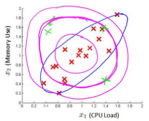

>本文为《吴恩达机器学习》的要点记录

# 异常检测 Anomaly Detection

## 高斯分布 Gaussion Distribution (正态分布)

如果变量$x$符合高斯分布$x \sim N(\mu, \sigma^{2})$, 则其概率密度函数为:

$$
p(x, \mu,\sigma^{2}) = \frac{1}{\sqrt{2\pi\sigma}}exp(-\frac{(x-\mu^{2})}{2\sigma^{2}})
$$

$$
\mu = \frac{1}{m}\sum_{i=1}^{m}x^{(i)}
$$

$$
\sigma^{2} = \frac{1}{m}\sum_{i=1}^{m}(x^{(i)}-\mu)^{2}
$$

## 异常检测算法

对于给定的数据集 $x^{(1)},x^{(2)},..,x^{(m)}$，我们要针对每一个特征计算$\mu$和 $\sigma^{2}$的估计值:

$$
\mu_{j} = \frac{1}{m}\sum_{i=1}^{m}x_{j}^{(i)}
$$

$$
\sigma^{2}_{j} = \frac{1}{m}\sum_{i=1}^{m}(x_{j}^{(i)}-\mu_{j})^{2}
$$

然后可以求得:

$$
p(x) = \prod_{j=1}^{n}p(x_j;\mu_j,\sigma_{j}^{2}) = \prod_{j=1}^{n}\frac{1}{\sqrt{2\pi\sigma_{j}}}exp(-\frac{(x_{j}-\mu_{j}^{2})}{2\sigma_{j}^{2}})
$$

定义:

$$
p(x) 
\begin{cases}
    < \varepsilon  & anomaly \\
    >= \varepsilon & normaly
\end{cases}
$$

>$\prod$ 代表元素所有元素的乘积

下面的三维图表表示的是密度估计函数，$z$轴为根据两个特征的值所估计$p(x)$值:

我们选择一个$\varepsilon$，将$p(x)=\varepsilon$作为我们的判定边界，当$p(x)>\varepsilon$时预测数据为正常数据，否则为异常

## 开发一个异常检测系统

异常检测算法是一个非监督学习算法，意味着我们无法根据结果变量$y$的值来告诉我们数据是否真的是异常的。我们需要另一种方法来帮助检验算法是否有效。当我们开发一个异常检测系统时，我们从带标记（异常或正常）的数据着手，我们从其中选择一部分正常数据用于构建训练集，然后用剩下的正常数据和异常数据混合的数据构成交叉检验集和测试集。

例如：我们有10000台正常引擎的数据，有20台异常引擎的数据。 我们这样分配数据：

6000台正常引擎的数据作为训练集

2000台正常引擎和10台异常引擎的数据作为交叉检验集

2000台正常引擎和10台异常引擎的数据作为测试集

具体的评价方法如下：

1. 根据测试集数据，我们估计特征的平均值和方差并构建$p(x)$函数
2. 对交叉检验集，我们尝试使用不同的$\varepsilon$值作为阀值，并预测数据是否异常，根据F1值或者查准率与查全率的比例来选择$\varepsilon$
3. 选出$\varepsilon$ 后，针对测试集进行预测，计算异常检验系统的$F1$值，或者查准率与查全率之比

## 选择特征

异常检测假设特征符合高斯分布，如果数据的分布不是高斯分布，异常检测算法也能够工作，但是最好还是将数据转换成高斯分布,例如使用对数函数：$x=log(x+c)$，其中$c$为非负常数； 或者$x=x^{c}$，$c$为 0-1 之间的一个分数等方法。

## 多元高斯分布

假使我们有两个相关的特征，而且这两个特征的值域范围比较宽，这种情况下，一般的高斯分布模型可能不能很好地识别异常数据。其原因在于，一般的高斯分布模型尝试的是去同时抓住两个特征的偏差，因此创造出一个比较大的判定边界。

下图中是两个相关特征，洋红色的线（根据ε的不同其范围可大可小）是一般的高斯分布模型获得的判定边界，很明显绿色的X所代表的数据点很可能是异常值，但是其$p(x)$值却仍然在正常范围内。多元高斯分布将创建像图中蓝色曲线所示的判定边界。

在一般的高斯分布模型中，我们计算$p(x)$的方法是： 通过分别计算每个特征对应的几率然后将其累乘起来，在多元高斯分布模型中，我们将构建特征的协方差矩阵，用所有的特征一起来计算$p(x)$。

我们首先计算所有特征的平均值，然后再计算协方差矩阵:

$$
p(x) = \prod_{j=1}^{n}p(x_j;\mu_j,\sigma_{j}^{2}) = \prod_{j=1}^{n}\frac{1}{\sqrt{2\pi\sigma_{j}}}exp(-\frac{(x_{j}-\mu_{j}^{2})}{2\sigma_{j}^{2}})
$$

$$
\mu_{j} = \frac{1}{m}\sum_{i=1}^{m}x_{j}^{(i)}
$$

$$
\sigma^{2}_{j} = \frac{1}{m}\sum_{i=1}^{m}(x_{j}^{(i)}-\mu_{j})^{2}
$$

$$
\sum =  \frac{1}{m}\sum_{i=1}^{m}(x^{(i)}-\mu)(x^{(i)}-\mu)^{T}=\frac{1}{m}(X-\mu)(X-\mu)^{T}
$$

其中$\mu$是一个向量，其每一个单元都是原特征矩阵中一行数据的均值。

最后高元分布的$p(x)$:

$$
p(x;\mu,\Sigma)= \frac{1}{(2\pi)^{\frac{n}{2}}|\Sigma|^{\frac{1}{2}}}exp(-\frac{1}{2}(x-\mu)^{T}\Sigma^{-1}(x-\mu)) 
$$

$|\Sigma|$是定矩阵,在Octave中用$det(sigma)$计算。下面我们来看看协方差矩阵是如何影响模型的：

上图是5个不同的模型，从左往右依次分析：

1. 是一个一般的高斯分布模型
2. 通过协方差矩阵，令特征1拥有较小的偏差，同时保持特征2的偏差
3. 通过协方差矩阵，令特征2拥有较大的偏差，同时保持特征1的偏差
4. 通过协方差矩阵，在不改变两个特征的原有偏差的基础上，增加两者之间的正相关性
5. 通过协方差矩阵，在不改变两个特征的原有偏差的基础上，增加两者之间的负相关性

多元高斯分布模型与原高斯分布模型的关系：

**可以证明的是，原本的高斯分布模型是多元高斯分布模型的一个子集，即像上图中的第1、2、3，3个例子所示，如果协方差矩阵只在对角线的单位上有非零的值时，即为原本的高斯分布模型了。**

原高斯分布模型和多元高斯分布模型的比较:

|  原高斯分布模型   | 多元高斯分布模型  |
|  ----  | ----  |
| 不能捕捉特征之间的相关性 但可以通过将特征进行组合的方法来解决  | 自动捕捉特征之间的相关性|
| 计算代价低，能适应大规模的特征| 计算代价较高 训练集较小时也同样适用|
||必须要有$m>n$，不然的话协方差矩阵 不可逆的，通常需要$m > 10n$, 另外特征冗余也会导致协方差矩阵不可逆|
