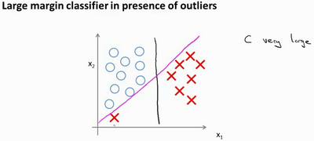

# 支持向量机 Support Vector Machine  (SVM)

>支持向量机，或者简称SVM。它与逻辑回归和神经网络相比,在学习复杂的非线性方程时提供了一种更为清晰，更加强大的方式。它的假设函数是:

$$
\min_{\theta}C\sum_{i=1}^{m}[y^{(i)}cost_{1}(\theta^{T}x^{(i)}) + (1 - y^{(i)})cost_{0}(\theta^{T}x^{(i)})]+\frac{1}{2}\sum_{i=1}^{n}\theta_{j}^{2}
$$

>对于逻辑回归来说

$cost_{1}(\theta^{T}x^{(i)})$->$-logh_{\theta}({x^{(i)})}$

$cost_{0}(\theta^{T}x^{(i)})$->$-logh_{\theta}^{x^{(i)}}(1-h_{\theta}(x^{(i)}))$

如果你有一个正样本(y = 1)，则其实我们仅仅要求$\theta^{T}x > 0$，就能将该样本恰当分出，这是因为如果$\theta^{T}x > 0$的话，我们的模型代价函数值为0。类似地，如果你有一个负样本，则仅需要$\theta^{T}x < 0$就会将负例正确分离。

但是，支持向量机的要求更高，不仅仅要能正确分开输入的样本，即不仅仅要求$\theta^{T}x > 0$，我们需要的是比0值大很多，比如大于等于1，我也想这个比0小很多，比如我希望它小于等于-1，这就相当于在支持向量机中嵌入了一个额外的安全因子，或者说安全的间距因子。那这个安全因子怎么训练出来呢？

## 理解大间距分类器

在SVM中我们可以把**参数C**理解为$\frac{1}{\lambda}$,因此:

$C$较大时，相当于$\lambda$较小，可能会导致过拟合，高方差。

$C$较小时，相当于$\lambda$较大，可能会导致低拟合，高偏差。

比如上面的黑色决策边界和粉色决策边界是我们使用**SVM**训练出来的，如果将C设置的比较大，则你最终会得到这条黑线,如果设置的比较小的话，最终会得到粉色的线。这就是为什么SVM又叫做**大间距分类器**的直观理解。

### 大边界的数学原理

我们看一下SVM的决策边界:

>上图 $p^{(i)}\centerdot \lVert\theta\lVert >= 1$ 就是 $\theta^{T}x >= 1$

1. 假设SVM选择了上图左边绿色的线作为决策边界。(其实SVM不会选择它，这个决策决策界离训练样本的距离很近)

使用线性代数的知识，可以说明这个绿色的决策界有一个垂直于它的向量$\theta$。从上图可以看到样本到$\theta$的投影$p^{(i)}$都比较小，这就导致最终最小化的$\theta$比较大

2. 假设SVM选择了上图右边绿色的线作为决策边界。

这时你会发现样本到$\theta$的投影$p^{(i)}$都比左边图的大，因此对应求出的$\theta$会小的多，即:

$$
\min_{\theta}\frac{1}{2}\sum_{j=1}^{n}\theta_{j}^{2}
$$

即SVM会试图极大化$p^{i}$这些范数(他们是训练样本到决策边界的距离)，这就是为什么支持向量机最终会找到大间距分类器的原因。

# SVM的使用

## 核函数 Kernel Function

