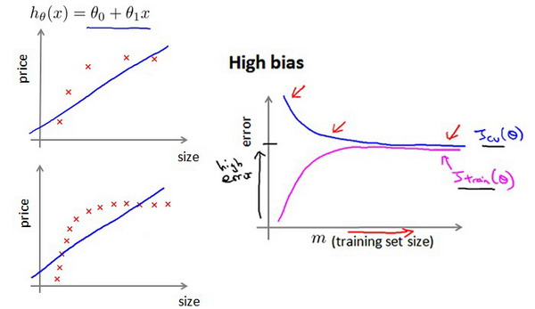

>本文为《吴恩达机器学习》的要点记录

# 应用机器学习的建议

当我们运用训练好了的模型来预测未知数据的时候发现有较大的误差，我们下一步可以做什么？通常我们会有下面选择:

1. 获得更多的训练样本
2. 尝试减少特征的数量
3. 尝试获得更多的特征
4. 尝试增加多项式特征
5. 尝试减少正则化程度$\lambda$
6. 尝试增加正则化程度$\lambda$

那么如何选择呢？可以通过一些**机器学习诊断法**来做出决定。

## 避免过拟合

为了检验算法是否过拟合，我们将数据分成**训练集、测试集和交叉验证集**，比如可以使用60%的数据作为训练集，用20%的数据作为测试集，用20%的数据作为交叉验证集。在训练过程中可以这样选择
模型:

1. 使用训练集训练出10个模型
2. 用10个模型分别对交叉验证集计算得出交叉验证误差（代价函数的值）
3. 选取代价函数值最小的模型
4. 用步骤3中选出的模型对测试集计算得出推广误差（代价函数的值）

## 诊断偏差和方差

当运行一个学习算法时，如果这个算法的表现不理想，那么多半是出现两种情况：要么是偏差比较大，要么是方差比较大。换句话说，出现的情况要么是欠拟合，要么是过拟合问题。
那么这两种情况，哪个和偏差有关，哪个和方差有关，或者是不是和两个都有关？

>对于偏差和方差的理解: https://www.zhihu.com/question/20448464

我们通常会通过将训练集和交叉验证集的代价函数误差与多项式的次数绘制在同一张图表上来帮助分析是**高偏差还是高方差**:

上面:

1. 训练集误差和交叉验证集误差近似时 : 偏差/欠拟合
​
2. 交叉验证集误差远大于训练集误差时：方差/过拟合

## 正则化和偏差/方差

一般我们采用下面方法选择$\lambda$:

1. 假设我们随机选取了12个$\lambda$,使用训练集训练出12个不同程度正则化的模型
2. 用12个模型分别对交叉验证集计算的出交叉验证误差
3. 选择得出交叉验证误差最小的模型
4. 运用步骤3中选出模型对测试集计算得出推广误差，最后选取误差z最小的

## 使用学习曲线来解决 偏差/方差 问题

我们可以通过不断增加训练集大小，来观察当前训练模型是处于 偏差 or 方差 问题:

上图训练模型处于**高偏差/欠拟合**的情况，这时增加数据到训练集不一定能有帮助。

上图训练模型处于**高方差/过拟合**的情况，增加更多数据到训练集可能可以提高算法效果。

## 神经网络

>使用较小的神经网络，类似于参数较少的情况，容易导致高偏差和欠拟合，但计算代价较小使用较大的神经网络，类似于参数较多的情况，容易导致高方差和过拟合，虽然计算代价比较大，但是可以通过正则化手段来调整而更加适应数据。
​
>通常选择较大的神经网络并采用正则化处理会比采用较小的神经网络效果要好。
​
>对于神经网络中的隐藏层的层数的选择，通常从一层开始逐渐增加层数，为了更好地作选择，可以把数据分为训练集、交叉验证集和测试集，针对不同隐藏层层数的神经网络训练神经网络，然后选择交叉验证集代价最小的神经网络。

## 总结

1. 获得更多的训练样本——解决高方差
2. 尝试减少特征的数量——解决高方差
3. 尝试获得更多的特征——解决高偏差
4. 尝试增加多项式特征——解决高偏差
5. 尝试减少正则化程度λ——解决高偏差
6. 尝试增加正则化程度λ——解决高方差

# 机器学习系统设计

构建一个学习算法的推荐方法为：
​
1. 从一个简单的能快速实现的算法开始，实现该算法并用交叉验证集数据测试这个算法
​
2. 绘制学习曲线，决定是增加更多数据，或者添加更多特征，还是其他选择
​
3. 进行误差分析：人工检查交叉验证集中我们算法中产生预测误差的样本，看看这些样本是否有某种系统化的趋势

## 误差分析 Error Analysis

### 查准率(Precision) 与 查全率(Recall)

我们可以将我们的算法预测的结果分成四种情况:

1. **正确肯定**（**True Positive,TP**）：预测为真，实际为真
​
2. **正确否定**（**True Negative,TN**）：预测为假，实际为假
​
3. **错误肯定**（**False Positive,FP**）：预测为真，实际为假
​
4. **错误否定**（**False Negative,FN**）：预测为假，实际为真

则:

查准率 = **$TP/(TP+FP)$**

查全率 = **$TP/(TP+FN)$**

### 偏斜类 (Skewed Classes) 问题

类偏斜情况表现为我们的训练集中有非常多的同一种类的样本，只有很少或没有其他类的样本。

>例如我们希望用算法来预测癌症是否是恶性的，在我们的训练集中，只有0.5%的实例是恶性肿瘤。假设我们编写一个非学习而来的算法，在所有情况下都预测肿瘤是良性的，那么误差只有0.5%。然而我们通过训练而得到的神经网络算法却有1%的误差。这时，误差的大小是不能视为评判算法效果的依据的。

为了避免**偏斜类问题**, 我们需要保证查准率和召回率的相对平衡。

例，在所有我们预测有恶性肿瘤的病人中，实际上有恶性肿瘤的病人的百分比，越高越好，这时我们的**查全率**是比较高的。

如果我们希望只在非常确信的情况下预测为真（肿瘤为恶性），即我们希望更高的**查准率**，我们可以使用比0.5更大的阀值，如0.7，0.9。这样做我们会减少错误预测病人为恶性肿瘤的情况，同时却会增加未能成功预测肿瘤为恶性的情况。

如果我们希望提高**查全率**，尽可能地让所有有可能是恶性肿瘤的病人都得到进一步地检查、诊断，我们可以使用比0.5更小的阀值，如0.3。

我们可以将不同阀值情况下，查全率与查准率的关系绘制成图表，曲线的形状根据数据的不同而不同：

那怎么选择阈值呢? 一种方法是计算**F1值**（**F1 Score**），其计算公式为:

$$
F_{1}Score = 2 \frac{PR}{P+R}
$$

# 训练集的数量

如果你有大量的数据，而且你训练了一种带有很多参数的学习算法，增大训练集的数量，可以提供一个高性能的学习算法。
