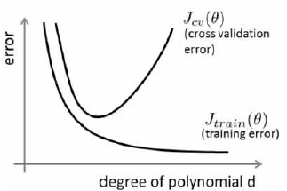

# 应用机器学习的建议

当我们运用训练好了的模型来预测未知数据的时候发现有较大的误差，我们下一步可以做什么？通常我们会有下面选择:

1. 获得更多的训练样本
2. 尝试减少特征的数量
3. 尝试获得更多的特征
4. 尝试增加多项式特征
5. 尝试减少正则化程度$\lambda$
6. 尝试增加正则化程度$\lambda$

那么如何选择呢？可以通过一些**机器学习诊断法**来做出决定。

## 避免过拟合

为了检验算法是否过拟合，我们将数据分成**训练集、测试集和交叉验证集**，比如可以使用60%的数据作为训练集，用20%的数据作为测试集，用20%的数据作为交叉验证集。在训练过程中可以这样选择
模型:

1. 使用训练集训练出10个模型
2. 用10个模型分别对交叉验证集计算得出交叉验证误差（代价函数的值）
3. 选取代价函数值最小的模型
4. 用步骤3中选出的模型对测试集计算得出推广误差（代价函数的值）

## 诊断偏差和方差

当运行一个学习算法时，如果这个算法的表现不理想，那么多半是出现两种情况：要么是偏差比较大，要么是方差比较大。换句话说，出现的情况要么是欠拟合，要么是过拟合问题。
那么这两种情况，哪个和偏差有关，哪个和方差有关，或者是不是和两个都有关？

>对于偏差和方差的理解: https://www.zhihu.com/question/20448464

我们通常会通过将训练集和交叉验证集的代价函数误差与多项式的次数绘制在同一张图表上来帮助分析是**高偏差还是高方差**:

上面:

1. 训练集误差和交叉验证集误差近似时 : 偏差/欠拟合
​
2. 交叉验证集误差远大于训练集误差时：方差/过拟合

## 正则化和偏差/方差

