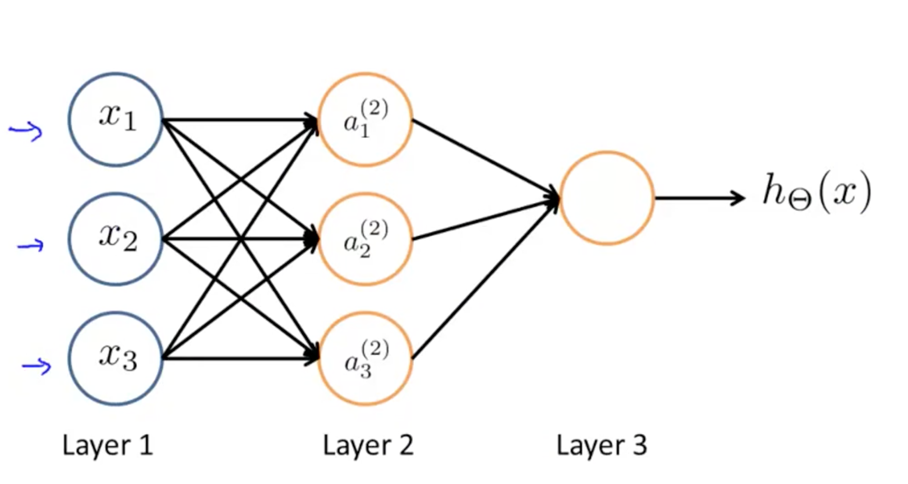

逻辑回归可以对非线性问题进行回归，不过对于特征比较多的分类问题来说逻辑回归就不是很适用了。对于高维特征的非线性分类问题，神经网络是典型的不需要增加特征数目就能完成非线性分类问题的模型。

## 神经网络概述与模型表示

人工神经网络（ANN：Artificial Neural Network），简称神经网络（NN：Neural Network）。迄今为止，人工神经网络尚无统一定义，其实一种模拟了人体神经元构成的数学模型，依靠系统的复杂程度，通过调整内部大量节点之间相互连接的关系，从而达到处理信息的目的。

上图显示了人工神经网络是一个分层模型，逻辑上可以分为三层：

- 输入层：输入层接收特征向量  x 。
- 输出层：输出层产出最终的预测  h 。
- 隐含层：隐含层介于输入层与输出层之间，之所以称之为隐含层，是因为当中产生的值并不像输入层使用的样本矩阵  X  或者输出层用到的标签矩阵  y  那样直接可见。

- 神经网络的表示

$$
a_{1}^{(2)} = g(\Theta_{10}^{(1)}x_{0} + \Theta_{11}^{(1)}x_{1}+ \Theta_{12}^{(1)}x_{2}+\Theta_{13}^{(1)}x_{3}) 
$$
$$
a_{2}^{(2)} = g(\Theta_{20}^{(1)}x_{0} + \Theta_{21}^{(1)}x_{1}+ \Theta_{22}^{(1)}x_{2}+\Theta_{23}^{(1)}x_{3}) 
$$
$$
a_{3}^{(2)} = g(\Theta_{30}^{(1)}x_{0} + \Theta_{31}^{(1)}x_{1}+ \Theta_{32}^{(1)}x_{2}+\Theta_{33}^{(1)}x_{3}) 
$$

$$
h_{\Theta}(x)= a_{1}^{(3)} = g(\Theta_{10}^{(2)}a_{0}^{(2)} + \Theta_{11}^{(2)}a_{1}^{(2)}+ \Theta_{12}^{(2)}a_{2}^{(2)}+\Theta_{13}^{(2)}a_{3}^{(2)}) 
$$

上面表达式中$a_{i}^{(j)}$代表第$j$的第$i$个激活单元，$\Theta(j)$代表第$j$层到第$j+1$层权重矩阵。

上述模型我们也可以使用向量来表示:

$$
x =\begin{bmatrix}
    x0 \\
    x1 \\
    x3\\
    x4
\end{bmatrix}
$$

$$
z^{(2)} = \begin{bmatrix}
    z_{1}^{(2)} \\
    z_{2}^{(2)} \\
    z_{3}^{(2)} \\
\end{bmatrix}
$$

$$
z^{(2)} = \Theta^{(1)}x
$$

$$
Add \quad a_{0}^{(2)} = 1
$$

$$
z^{(3)} = \Theta^{(2)}a^{(2)}
$$

$$
h_{\Theta}(x) = a^{(3)} = g(z^{(3)})
$$

>$z_{1}^{(2)} = \Theta_{10}^{(1)}x_{0} + \Theta_{11}^{(1)}x_{1}+ \Theta_{12}^{(1)}x_{2}+\Theta_{13}^{(1)}x_{3}$

## 代价函数

神经网络学习是基于逻辑回归的，它的代价函数如下:

$$
J(\Theta) = - \frac{1}{m} \sum_{i=1}^m \sum_{k=1}^K \left[y^{(i)}_k \log ((h_\Theta (x^{(i)}))_k) + (1 - y^{(i)}_k)\log (1 - (h_\Theta(x^{(i)}))_k)\right] + \frac{\lambda}{2m}\sum_{l=1}^{L-1} \sum_{i=1}^{s_l} \sum_{j=1}^{s_{l+1}} ( \Theta_{j,i}^{(l)})^2
$$

上面$h_{\Theta}(x) \in R^{K}$,$(h_{\Theta}(x))_{i} = i^{th} \quad output$

## 最小化代价函数

为了计算最小的$minJ(\Theta)$,我们需要计算:

$$
J(\Theta) \quad  and  \qquad  \frac{\partial}{\partial\theta_{ij}^{l}}J_{(\Theta)}
$$

### 反向传播算法

为了计算$\frac{\partial}{\partial\theta_{ij}^{l}}J_{(\Theta)}$ 

引入 $\delta_{j}^{(l)}$ 

>实际上 $\delta_{j}^{(l)} = \frac{\partial}{\partial z_{j}^{(l)}}cost(i)$

>而 $cost(i) = y^{(i)}\log(h_{\theta}(x^{(i)})) +(1-y^{(i)})\log(1 - h_{\theta}(x^{(i)}))$

$\delta_{j}^{(l)}$代表每一层的激活值$a_{j}^{(l)}$和$y_{j}$的误差，比如:

$\delta_{j}^{(4)} = a_{j}^{(4)} - y_{j}$  （对于用向量写法， 去掉下标就可以了）

那么:

$$
\delta^{(3)} = (\Theta^{(3)})^{T}\delta^{(4)}.*g^{'}(z^{(3)}) 
$$

$$
\delta^{(2)} = (\Theta^{(2)})^{T}\delta^{(3)}.*g^{'}(z^{(2)}) 
$$

上面$g^{'}(z^{(3)})$利用微积分计算的的值为:$a^{(3)}.*(1-a^{(3)})$

即:

$$
\delta^{(l)} =\begin{cases}
    a^{(l)} - y  & l = L \\
    (\Theta^{(l)}\delta^{(l+1)})^T .*g'(z^{(l)}) &  {l=2,3,...,L-1}
\end{cases}
$$

$$
g'(z^{(l)}) = a^{(l)} .* (1-a^{(l)})
$$

>反向传播中的反向二字也正是从该公式中得来，本层的误差  δ(l)  需要由下一层的误差  δ(l+1)  反向推导。

### 反向传播算法的操作过程

假定有训练集$(x^{(1)}, y^{(1)}),...,(x^{(m)},y^{(m)})$，使用了反向传播的神经网络训练过程如下：

1. $for \quad all \quad l,i,j$, 初始化权值梯度$\Delta^{(l)}$ :

$$
\Delta^{(l)} = 0
$$

2. $for \quad i=1  \quad to  \quad m$:
   
$$
\begin{aligned}
    & 令 a^{(1)} = x^{i} \\
    & 执行前向传播算法，计算各层的激活向量：a^{(l)} \\
    & 通过标签向量 y^{(i)}，计算输出层的误差向量：\delta^{(L)} = a^{(L)} - y^{(i)} \\
    & 反向依次计算其他层误差向量：\delta^{(L-1)},\delta^{(L-2)},...,\delta^{(2)} \\
    &求 \Delta_{ij}^{(l)} = a_j^{(l)}\delta_i^{(l+1)}，即：\Delta^{(l)} = \delta^{(l+1)}(a^{(l)})^T\\
\end{aligned}
$$

3. 求各层权值的更新增量$D^{(l)}$，连接偏置的权值不进行正规化：

$$
D^{(l)}_{i,j} =
\begin{cases}
\dfrac{1}{m}(\Delta^{(l)}_{i,j} + \lambda\Theta^{(l)}_{i,j}), \quad {if j \neq 0} \\
\frac{1}{m}\Delta_{ij}^{(l)}, \quad {if \quad j=0}
\end{cases}
$$

4. 更新各层的权值矩阵$\Theta(l)$ ，其中$\alpha$为学习率：

$$
\Theta^{(l)} = \Theta^{(l)} + \alpha D^{(l)}
$$

**$\frac{\partial}{\partial\theta_{ij}^{l}}J_{(\Theta)} = D_{ij}^{(l)}$**