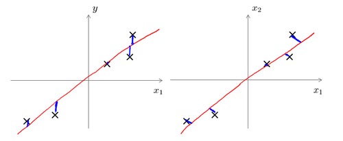

简单回顾一下非监督学习: 在非监督学习中，我们需要将一系列无标签（$y$）的训练数据，输入到一个算法中，然后我们告诉这个算法，快去为我们找找这个数据的内在结构给定数据。

# 聚类 Clustering  (非监督学习算法)

聚类算法简单的说就是把数据在训练集中分成不同的簇。

## K-均值算法

它是最普及的聚类算法，算法接受一个未标记的数据集，然后将数据聚类成不同的组。

它的算法为:

1. 首先选择$K$个随机的点，称为聚类中心（cluster centroids）
2. 对于数据集中的每一个数据，按照距离$K$个中心点的距离，将其与距离最近的中心点关联起来，与同一个中心点关联的所有点聚成一类。
3. 计算每一个组的平均值，将该组所关联的中心点移动到平均值的位置。
4. 重复步骤2-3直至中心点不再变化。

用$\mu^{1},\mu^{2},...\mu^{n}$来表示聚类中心，用$c^{(1)},c^{(2)},...c^{(m)}$来存储与第$i$个实例数据最近的聚类中心的索引，K-均值算法的伪代码如下：

```
Repeat {
​
    for i = 1 to m
​
        c(i) := index (form 1 to K) of cluster centroid closest to x(i)
​
    for k = 1 to K
​
        μk := average (mean) of points assigned to cluster k

}
```

算法分为两个步骤，第一个**for**循环是赋值步骤，即：对于每一个样例$i$，计算其应该属于的类。第二个**for**循环是聚类中心的移动，即：对于每一个类$K$，重新计算该类的质心。

K-均值的代价函数为:

$$
J(c^{(1)},....c^{(m)},\mu_{1},...,\mu_{K}) = \frac{1}{m}\sum_{i=1}^{m}\lVert X^{(i)}-\mu_{c^{(i)}}\lVert^{2}
$$

K-均值迭代的过程一定会是每一次迭代都在减小代价函数，不然便是出现了错误。

# 降维 Dimensionality Reduction

降维也是属于无监督学习问题，它可以实现 **数据压缩&数据可视化**。

## 主成分分析 PCA (Principal Component Analysic)

在PCA中，我们要做的是找到一个方向向量（Vector direction），当我们把所有的数据都投射到该向量上时，我们希望投射平均均方误差能尽可能地小。方向向量是一个经过原点的向量，而投射误差是从特征向量向该方向向量作垂线的长度。


假如要将$n$维数据降至$k$维，目标是找到向量$\mu_{1},...,\mu_{k}$使得总的投射误差最小。它与线性回归是两种不同的算法。主成分分析最小化的是投射误差（Projected Error），而线性回归尝试的是最小化预测误差。线性回归的目的是预测结果，而主成分分析不作任何预测:



PCA将$n$个特征降维到$k$个，可以用来进行数据压缩，如果100维的向量最后可以用10维来表示，那么压缩率为90%。

### PCA 算法实现

PCA的算法实现分为三步:

1. 均值归一化

需要计算出所有特征的均值，然后令$x_{j}=x_{j}-\mu_{j}$。如果特征是在不同的数量级上，我们还需要将其除以标准差$\sigma^{2}$。

2. 计算协方差矩阵

$$
\sum = \frac{1}{m}\sum_{i=1}^{n}(x^{(i)})(x^{(i)})^{T}
$$

什么是协方差矩阵呢? 

3. 计算协方差矩阵$\sum$的特征向量


